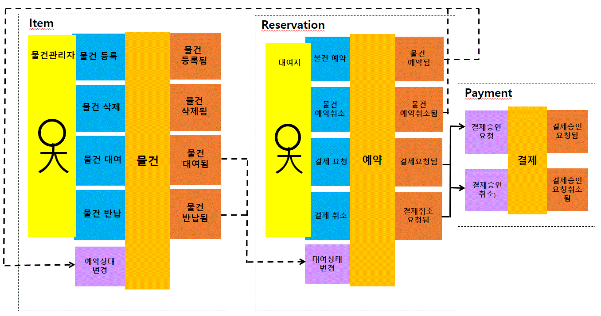
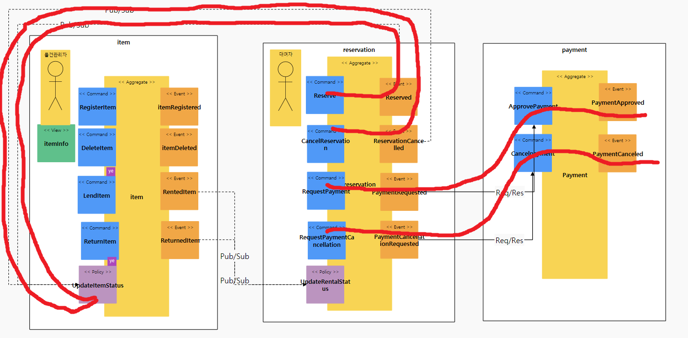
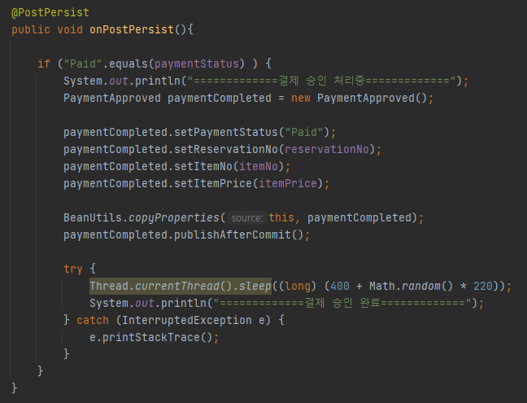

# GDmarket
GDmarket : 근대마켓 - 근거리 대여 마켓


# Table of contents

- 근대마켓
   - [서비스 시나리오](#서비스-시나리오)
   - [체크포인트](#체크포인트)
   - [분석/설계](#분석설계)
   - [구현:](#구현-)
      - [DDD 의 적용](#ddd-의-적용)
      - [폴리글랏 퍼시스턴스](#폴리글랏-퍼시스턴스)
      - [폴리글랏 프로그래밍](#폴리글랏-프로그래밍)
      - [동기식 호출 과 Fallback 처리](#동기식-호출-과-Fallback-처리)
      - [비동기식 호출 과 Eventual Consistency](#비동기식-호출-과-Eventual-Consistency)
   - [운영](#운영)
      - [CI/CD 설정](#cicd설정)
      - [동기식 호출 / 서킷 브레이킹 / 장애격리](#동기식-호출-서킷-브레이킹-장애격리)
      - [오토스케일 아웃](#오토스케일-아웃)
      - [무정지 재배포](#무정지-재배포)
   - [신규 개발 조직의 추가](#신규-개발-조직의-추가)


# 서비스 시나리오

기능적 요구사항
1. 물건관리자는 물건을 등록할 수 있다
2. 물건관리자는 물건을 삭제할 수 있다.
3. 대여자는 물건을 선택하여 예약한다.
4. 대여자는 예약을 취소할 수 있다.   
5. 예약이 완료되면 해당 물건은 대여불가 상태로 변경된다.
6. 대여자가 결제한다.
7. 대여자는 결제를 취소할 수 있다.
8. 물건관리자는 물건을 대여해준다.
9. 대여자가 대여요청을 취소할 수 있다.
10. 물건이 반납되면 물건은 대여가능 상태로 변경된다.
11. 물건관리자는 물건 통합상태를 중간중간 조회할 수 있다.


비기능적 요구사항
1. 트랜잭션
    1. 결제승인이 되지 안은 건은 결제요청이 완료되지 않아야한다. Sync 호출
2. 장애격리
    1. 물건관리시스템이 수행되지 않더라도 대여 요청은 365일 24시간 받을 수 있어야 한다. > Async (event-driven), Eventual Consistency
    1. 결제시스템이 과중되면 주문을 잠시동안 받지 않고 결제를 잠시후에 하도록 유도한다> Circuit breaker, fallback
3. 성능
    1. 물건관리자가 등록한 물건의 통합상태를 별도로 확인할 수 있어야 한다.> CQRS


# 체크포인트

1. Saga
1. CQRS
1. Correlation
1. Req/Resp
1. Gateway
1. Deploy/ Pipeline
1. Circuit Breaker
1. Autoscale (HPA)
1. Zero-downtime deploy (Readiness Probe)
1. Config Map/ Persistence Volume
1. Polyglot
1. Self-healing (Liveness Probe)


# 분석/설계


## AS-IS 조직 (Horizontally-Aligned)


## TO-BE 조직 (Vertically-Aligned)


## Event Storming 결과
* MSAEz 로 모델링한 이벤트스토밍 결과:  http://www.msaez.io/#/storming/jF5FVdhZRTaLAtq1ZhWOo6aMi0X2/mine/dcfc80f0cee2bfa743d5c53b608d42c6


### 이벤트 도출


### 부적격 이벤트 탈락


    - 과정중 도출된 잘못된 도메인 이벤트들을 걸러내는 작업을 수행함
	- 물건목록조회됨, 물건대여상태조회됨  :  UI 의 이벤트이며 Domain의 상태변화가 없는 이벤트로 제외 아니라서 제외


### 액터, 커맨드 부착하여 읽기 좋게


### 어그리게잇으로 묶기


    - 물건, 예약, 결제 어그리게잇을 생성하고 그와 연결된 command 와 event 들에 의하여 트랜잭션이 유지되어야 하는 단위로 그들 끼리 묶어줌

### 바운디드 컨텍스트로 묶기


    - 도메인 서열 분리 
        - Core Domain:  item, reservation : 없어서는 안될 핵심 서비스이며, 연견 Up-time SLA 수준을 99.999% 목표, 배포주기는 app 의 경우 1주일 1회 미만, store 의 경우 1개월 1회 미만
        - Supporting Domain: -- : 경쟁력을 내기위한 서비스이며, SLA 수준은 연간 60% 이상 uptime 목표, 배포주기는 각 팀의 자율이나 표준 스프린트 주기가 1주일 이므로 1주일 1회 이상을 기준으로 함.
        - General Domain:  pay : 결제서비스로 3rd Party 외부 서비스를 사용하는 것이 경쟁력이 높음 

### 폴리시 부착 (괄호는 수행주체, 폴리시 부착을 둘째단계에서 해놔도 상관 없음. 전체 연계가 초기에 드러남)


### 폴리시의 이동과 컨텍스트 매핑 (점선은 Pub/Sub, 실선은 Req/Resp)



    - 컨텍스트 매핑하여 묶어줌.	

### 완성된 모형


    - View Model 추가

### 기능적 요구사항 검증



   	- 물건관리자가 물건을 등록한다. (ok)
    - 물건관리자는 물건을 삭제할 수 있다. (ok)
   	- 대여자는 물건을 선택하여 예약한다. (ok)
    - 대여자는 예약을 취소할 수 있다. (ok)
    - 대여자가 예약을 취소할 수 있다. (ok)
    - 예약이 완료되면 해당 물건은 대여불가 상태로 변경된다. (ok)
	- 대여자는 결제한다. (ok)
    - 대여자는 결제를 취소할 수 있다. (ok)
	


	- 물건관리자는 물건을 대여해준다. (ok)
    - 물건이 반납되면 물건은 대여가능 상태로 변경된다. (ok)


	- 물건관리자는 물건의 통합상태를 조회할 수 있다. (ok)


### 비기능 요구사항 검증


    - 1) 결제승인이 되지 안은 건은 결제요청이 완료되지 않아야한다. (Req/Res)
    - 2) 물건관리시스템이 수행되지 않더라도 대여 요청은 365일 24시간 받을 수 있어야 한다. (Pub/sub)
    - 3) 결제시스템이 과중되면 주문을 잠시동안 받지 않고 결제를 잠시후에 하도록 유도한다. (Circuit breaker)
    - 4) 물건관리자가 등록한 물건의 통합상태를 별도로 확인할 수 있어야 한다. (CQRS, DML/SELECT 분리)


## 헥사고날 아키텍처 다이어그램 도출 (Polyglot)


    - Chris Richardson, MSA Patterns 참고하여 Inbound adaptor와 Outbound adaptor를 구분함
    - 호출관계에서 PubSub 과 Req/Resp 를 구분함
    - 서브 도메인과 바운디드 컨텍스트의 분리:  각 팀의 KPI 별로 아래와 같이 관심 구현 스토리를 나눠가짐
    - Payment의 경우 Polyglot 검증을 위해 Hsql로 셜계


# 구현

서비스를 로컬에서 실행하는 방법은 아래와 같다 (각자의 포트넘버는 8081 ~ 808n 이다)

```
cd item
mvn spring-boot:run

cd reservation
mvn spring-boot:run 

cd pay
mvn spring-boot:run  
```

## DDD 의 적용

각 서비스에서 도출된 핵심 aggregate 객체를 entity 로 선언하였다. 아래 캡처의 item 마이크로 서비스가 그 예시이다.


Entity Pattern 과 Repository Pattern 을 적용하여 JPA 를 통하여 다양한 데이터소스 유형 (RDB or NoSQL) 에 대한 별도의 처리가 없도록 데이터 접근 어댑터를 자동 생성하기 위하여 Spring Data REST 의 RestRepository 를 적용하였다


## 폴리글랏 퍼시스턴스
item 서비스와 reservation 서비스는 H2 DB로 구현하고, 그와 달리 payment 서비스의 경우 Hsql으로 구현하여, MSA간 서로 다른 종류의 DB간에도 문제 없이 동작하여 다형성을 만족하는지 확인하였다.

item, reservation 서비스의 pom.xml 설정


payment 서비스의 pom.xml 설정


## Gateway 적용

gateway > applitcation.yml 설정


gateway 테스트

```
http POST http://gateway:8080/items itemName=Camera itemPrice=100 itemStatus=Rentable rentalStatus=NotRenting
```


## 동기식 호출 과 Fallback 처리

설계에서, 아래의 두 가지 호출은 동기식 호출을 이용하여 일관성을 유지도록 하였다. 

- "예약 시스템의 결제 요청" > "결제 시스템의 결제 승인" 
- "예약 시스템의 결제 취소 요청" > "결제 시스템의 결제 취소"

호출 프로토콜은 앞서 작성한 REST Repository 에 의해 노출되어있는 REST 서비스를 FeignClient 를 이용하여 호출하도록 구현 하였다.

- 결제서비스를 호출하기 위하여 FeignClient 를 이용하여 Service 대행 인터페이스 (Proxy) 를 구현
```java
// reservation > external > PaymentService.java

@FeignClient(name="payment", url="${api.payment.url}")
public interface PaymentService {

    @RequestMapping(method= RequestMethod.POST, path="/payments")
    public void approvePayment(@RequestBody Payment payment);

    @RequestMapping(method= RequestMethod.DELETE, path="/payments/{paymentNo}")
    public void cancelPayment(@PathVariable("paymentNo") Integer paymentNo);
}
```


- 결제 요청을 동기 호출로 받으면 결제 승인 처리
```java
// payment > Payment.java (Entity)

    @PostPersist
    public void onPostPersist(){

        if ("Paid".equals(paymentStatus) ) {
            System.out.println("=============결제 승인 처리중=============");
            PaymentApproved paymentCompleted = new PaymentApproved();

            paymentCompleted.setPaymentStatus("Paid");
            paymentCompleted.setReservationNo(reservationNo);
            paymentCompleted.setItemNo(itemNo);
            paymentCompleted.setItemPrice(itemPrice);

            BeanUtils.copyProperties(this, paymentCompleted);
            paymentCompleted.publishAfterCommit();

			System.out.println("=============결제 승인 완료=============");
        }
    }
	
```



- 동기식 호출이 적용되서 reservation 시스템과 payment 시스템이 일관성을 갖게 됨 
```
# items 등록
http POST localhost:8081/items/ itemName=Camera itemPrice=100 itemStatus=Rentable rentalStatus=NotRenting
	
# 예약 하기
http POST localhost:8082/reservations customerName=YoungEunSong customerId=1 itemNo=1 itemName=Camera itemPrice=100 paymentStatus=NotPaid rentalStatus=NotRenting

# reservation 서비스에서 결제 요청
http PATCH localhost:8082/reservations/1 paymentStatus=Paid
```

```
# payment 서비스에 결제 내역 생성확인
http localhost:8083/payments
```


- 동기식 호출이 적용되서 payment 시스템에 장애가 있으면, reservation의 결제 요청이 불가능

```
# payment 서비스 중단 후 다시 reservation 서비스에서 결제 요청 -> 500 Error
http PATCH localhost:8082/reservations/2 paymentStatus=Paid
```


## 비동기식 호출 / 시간적 디커플링 / 장애격리


'예약됨(Reserved)', '예약취소됨(ReservationCancelled)', '대여됨(RentedItem)', '반납됨(ReturnedItem' 이벤트는 비동기식으로 각각 처리한다. 아래 예시는 그 중 '예약됨(Reserved)' 이벤트에 관한 내용이다.

- '예약됨(Reserved)' 이벤트를 카프카로 송출한다(Publish)


- 물건관리자는 '예약됨(Reserved)' 이벤트를 수신하여 자신의 정책을 처리하도록 PolicyHandler 를 구현한다.
- 물건관리자는 이벤트로부터 수신받은 '물건상태' 정보를 item의 ItemStatus에 저장한다.
- 물건은 특정 인물에게 예약되었으므로, 더이상 다른 사람들에게는 대여불가능(NotRentable)하다는 정보를 갖게 된다. 


reservation 서비스는 item 서비스와 완전히 분리되어있으며(sync transaction 없음) 이벤트 수신에 따라 처리되기 때문에, item 서비스가 유지보수로 인해 잠시 내려간 상태라도 예약을 진행해도 문제 없다.(시간적 디커플링):
```
# items 등록
http POST localhost:8081/items/ itemName=Camera itemPrice=100 itemStatus=Rentable rentalStatus=NotRenting
	
# item 서비스를 내려놓은 후 reservation 서비스에서 예약 하기
http POST localhost:8082/reservations customerName=YoungEunSong customerId=1 itemNo=1 itemName=Camera itemPrice=100 paymentStatus=NotPaid rentalStatus=NotRenting
```

```
# item 서비스 기동
cd item
mvn spring-boot:run

# 예약한 item 의 itemStatus가 NotRentable로 바뀌었는지 확인 (pub/sub)
http localhost:8081/items/1 
```


## 시나리오 구현 검증
```
# items 등록
http POST localhost:8081/items/ itemName=Camera itemPrice=100 itemStatus=Rentable rentalStatus=NotRenting
```

```
# 예약
http POST localhost:8082/reservations customerName=YoungEunSong customerId=1 itemNo=1 itemName=Camera itemPrice=100 paymentStatus=NotPaid rentalStatus=NotRenting
```

```
# 예약한 item의 itemStatus가 NotRentable로 바뀌었는지 확인 (pub/sub)
http localhost:8081/items/1 
```

```
# 결제요청 
http PATCH localhost:8082/reservations/1 paymentStatus=Paid
```

```
# payments 생성 되어있는지 확인 (req/res)
http localhost:8083/payments
```

```
# 대여 
http PATCH localhost:8081/items/1 itemNo=1 reservationNo=1 itemStatus=NotRentable rentalStatus=Renting 
```

```
# reservations의 rentalStatus가 Renting으로 변경되었는지 확인 (pub/sub)
http localhost:8082/reservations/1
```

```
# 반납 
http PATCH localhost:8081/items/1 itemNo=1 reservationNo=1 itemStatus=Rentable rentalStatus=Returned
```

```
# reservations의 rentalStatus가 Returned으로 변경되었는지 확인 (pub/sub)
http localhost:8082/reservations/1
```

```
# CQRS의 적용, view를 통해 item과 reservation의 정보를 한 번에 확인
http localhost:8081/itemInfoes
```


# 운영

## Deploy / Pipeline

- 네임스페이스 만들기
```
kubectl create ns phone82
kubectl get ns
```


- 폴더 만들기, 해당폴더로 이동
```
mkdir phone82
cd phone 82
```


- 소스 가져오기
```
git clone https://github.com/phone82/app.git
```


- 빌드하기
```
cd app
mvn package -Dmaven.test.skip=true
```


- 도커라이징: Azure 레지스트리에 도커 이미지 푸시하기
```
az acr build --registry admin02 --image admin02.azurecr.io/app:latest .
```


- 컨테이너라이징: 디플로이 생성 확인
```
kubectl create deploy app --image=admin02.azurecr.io/app:latest -n phone82
kubectl get all -n phone82
```


- 컨테이너라이징: 서비스 생성 확인
```
kubectl expose deploy app --type="ClusterIP" --port=8080 -n phone82
kubectl get all -n phone82
```


- pay, store, customer, gateway에도 동일한 작업 반복


-(별첨)deployment.yml을 사용하여 배포

- deployment.yml 편집
```
namespace, image 설정
env 설정 (config Map) 
readiness 설정 (무정지 배포)
liveness 설정 (self-healing)
resource 설정 (autoscaling)
```


- deployment.yml로 서비스 배포
```
cd app
kubectl apply -f kubernetes/deployment.yml
```

## 동기식 호출 / 서킷 브레이킹 / 장애격리

* 서킷 브레이킹 프레임워크의 선택: Spring FeignClient + Hystrix 옵션을 사용하여 구현함

시나리오는 단말앱(app)-->결제(pay) 시의 연결을 RESTful Request/Response 로 연동하여 구현이 되어있고, 결제 요청이 과도할 경우 CB 를 통하여 장애격리.

- Hystrix 를 설정:  요청처리 쓰레드에서 처리시간이 610 밀리가 넘어서기 시작하여 어느정도 유지되면 CB 회로가 닫히도록 (요청을 빠르게 실패처리, 차단) 설정
```
# application.yml
feign:
  hystrix:
    enabled: true
    
hystrix:
  command:
    # 전역설정
    default:
      execution.isolation.thread.timeoutInMilliseconds: 610

```


* siege 툴 사용법:
```
 siege가 생성되어 있지 않으면:
 kubectl run siege --image=apexacme/siege-nginx -n phone82
 siege 들어가기:
 kubectl exec -it pod/siege-5c7c46b788-4rn4r -c siege -n phone82 -- /bin/bash
 siege 종료:
 Ctrl + C -> exit
```
* 부하테스터 siege 툴을 통한 서킷 브레이커 동작 확인:
- 동시사용자 100명
- 60초 동안 실시

```
siege -c100 -t60S -r10 -v --content-type "application/json" 'http://app:8080/orders POST {"item": "abc123", "qty":3}'
```
- 부하 발생하여 CB가 발동하여 요청 실패처리하였고, 밀린 부하가 pay에서 처리되면서 다시 order를 받기 시작


- report


- CB 잘 적용됨을 확인


### 오토스케일 아웃

- 대리점 시스템에 대한 replica 를 동적으로 늘려주도록 HPA 를 설정한다. 설정은 CPU 사용량이 15프로를 넘어서면 replica 를 10개까지 늘려준다:

```
# autocale out 설정
store > deployment.yml 설정
```


```
kubectl autoscale deploy store --min=1 --max=10 --cpu-percent=15 -n phone82
```


-
- CB 에서 했던 방식대로 워크로드를 2분 동안 걸어준다.
```
kubectl exec -it pod/siege-5c7c46b788-4rn4r -c siege -n phone82 -- /bin/bash
siege -c100 -t120S -r10 -v --content-type "application/json" 'http://store:8080/storeManages POST {"orderId":"456", "process":"Payed"}'
```


- 오토스케일이 어떻게 되고 있는지 모니터링을 걸어둔다:
```
kubectl get deploy store -w -n phone82
```
- 어느정도 시간이 흐른 후 스케일 아웃이 벌어지는 것을 확인할 수 있다. max=10
- 부하를 줄이니 늘어난 스케일이 점점 줄어들었다.


- 다시 부하를 주고 확인하니 Availability가 높아진 것을 확인 할 수 있었다.


## 무정지 재배포

* 먼저 무정지 재배포가 100% 되는 것인지 확인하기 위해서 Autoscale 이나 CB 설정을 제거함


- seige 로 배포작업 직전에 워크로드를 모니터링 함.
```
kubectl apply -f kubernetes/deployment_readiness.yml
```
- readiness 옵션이 없는 경우 배포 중 서비스 요청처리 실패


- deployment.yml에 readiness 옵션을 추가


- readiness적용된 deployment.yml 적용

```
kubectl apply -f kubernetes/deployment.yml
```
- 새로운 버전의 이미지로 교체
```
cd acr
az acr build --registry admin02 --image admin02.azurecr.io/store:v4 .
kubectl set image deploy store store=admin02.azurecr.io/store:v4 -n phone82
```
- 기존 버전과 새 버전의 store pod 공존 중


- Availability: 100.00 % 확인


## Config Map

- apllication.yml 설정

* default쪽


* docker 쪽


- Deployment.yml 설정


- config map 생성 후 조회
```
kubectl create configmap apiurl --from-literal=url=http://pay:8080 --from-literal=fluentd-server-ip=10.xxx.xxx.xxx -n phone82
```


- 설정한 url로 주문 호출
```
http POST http://app:8080/orders item=dfdf1 qty=21
```


- configmap 삭제 후 app 서비스 재시작
```
kubectl delete configmap apiurl -n phone82
kubectl get pod/app-56f677d458-5gqf2 -n phone82 -o yaml | kubectl replace --force -f-
```


- configmap 삭제된 상태에서 주문 호출
```
http POST http://app:8080/orders item=dfdf2 qty=22
```


## Self-healing (Liveness Probe)

- store 서비스 정상 확인


- deployment.yml 에 Liveness Probe 옵션 추가
```
cd ~/phone82/store/kubernetes
vi deployment.yml

(아래 설정 변경)
livenessProbe:
	tcpSocket:
	  port: 8081
	initialDelaySeconds: 5
	periodSeconds: 5
```


- store pod에 liveness가 적용된 부분 확인


- store 서비스의 liveness가 발동되어 13번 retry 시도 한 부분 확인


